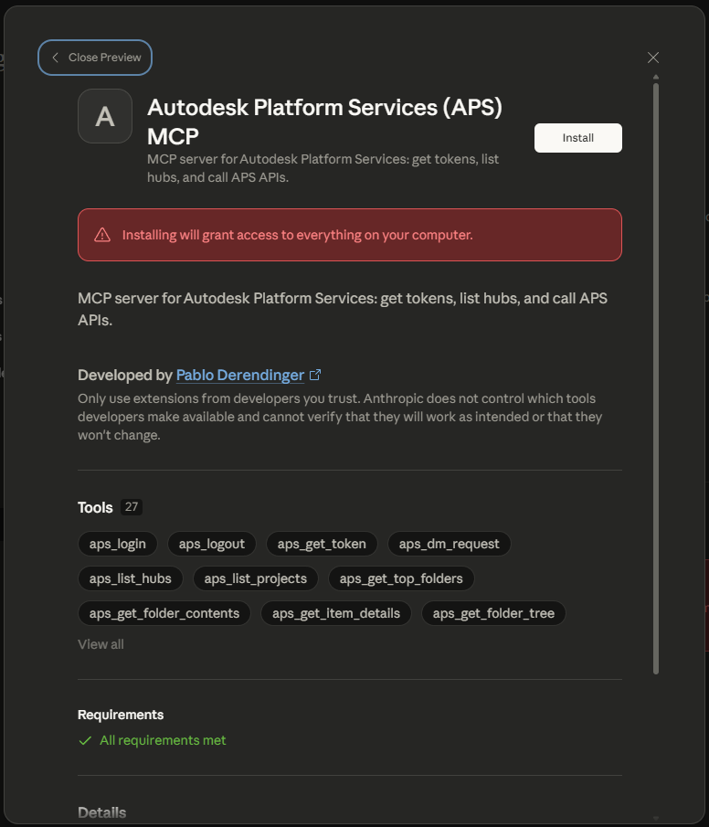
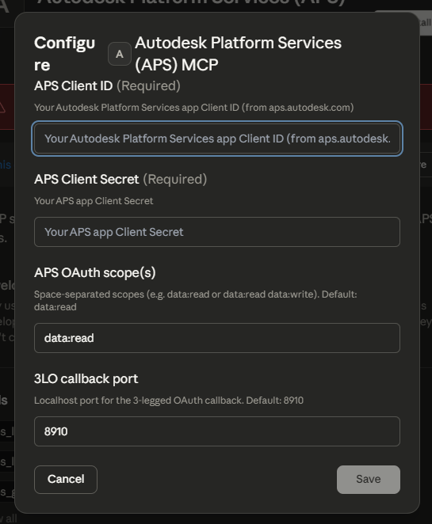
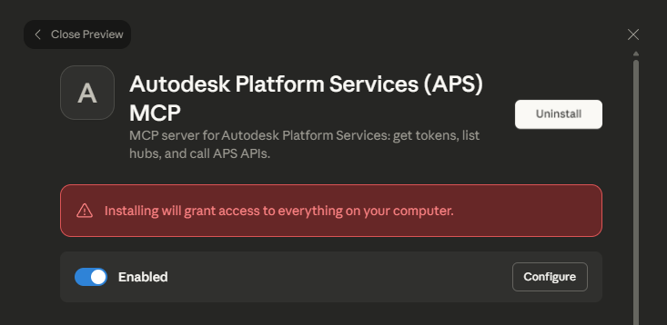

# Installing the APS MCP in Claude Desktop

This guide walks through installing the **Autodesk Platform Services (APS) MCP** bundle directly from the Claude desktop app.

## Prerequisites

- [Claude desktop app](https://claude.ai/download) installed
- An [APS application](https://aps.autodesk.com/) with a **Client ID** and **Client Secret**
- The `acc-mcp.mcpb` bundle (build it with `npm run pack` or download it from releases)

---

## Step 1 – Open Extensions Settings

In the Claude desktop app, go to **Settings → Extensions**.

You will see the Extension Settings panel with options for auto-updates and the built-in Node.js runtime for MCP servers. To install the bundle, click **Install Extension** at the bottom of the page.


> **Note:** "Use Built-in Node.js for MCP" is enabled by default. This means the app uses its own bundled Node.js runtime (24.x) instead of any system-installed version, so Node.js does not need to be installed on your machine.

---

## Step 2 – Preview and Install the Extension

After selecting the `.mcpb` file, Claude shows a preview of the extension before installing.



The preview displays:

- **Name:** Autodesk Platform Services (APS) MCP
- **Description:** MCP server for Autodesk Platform Services: get tokens, list hubs, and call APS APIs.
- **Developer:** Pablo Derendinger
- **Tools (27):** `aps_login`, `aps_logout`, `aps_get_token`, `aps_dm_request`, `aps_list_hubs`, `aps_list_projects`, `aps_get_top_folders`, `aps_get_folder_contents`, `aps_get_item_details`, `aps_get_folder_tree`, and more.
- **Requirements:** All requirements met

> **Security notice:** Claude warns that installing an extension grants it access to your computer. Only install extensions from developers you trust.

Click **Install** to proceed.

---

## Step 3 – Configure Your APS Credentials

After clicking Install, a configuration dialog appears where you enter your APS application credentials.



| Field | Required | Description |
|-------|----------|-------------|
| **APS Client ID** | Yes | Your APS app Client ID from [aps.autodesk.com](https://aps.autodesk.com) |
| **APS Client Secret** | Yes | Your APS app Client Secret |
| **APS OAuth scope(s)** | No | Space-separated scopes (e.g. `data:read data:write`). Default: `data:read` |
| **3LO callback port** | No | Localhost port for the 3-legged OAuth callback. Default: `8910` |

Fill in your credentials and click **Save**.

---

## Step 4 – Verify the Installation

Once installed, the extension detail page shows the extension is **Enabled** with options to **Uninstall** or **Configure**.



The toggle must be blue (enabled) for the MCP tools to be available in Claude conversations. You can return to this screen at any time to reconfigure your credentials via the **Configure** button.

---

## Using the MCP Tools

Once installed, the APS MCP tools are automatically available in your Claude conversations. Start by asking Claude to list your hubs:

```
List my APS hubs
```

For 3-legged OAuth flows (user-delegated access), use `aps_login`. For service-to-service access, the tools use your Client ID and Secret directly.

See the [main README](../README.md#tools) for a full list of available tools and the typical browsing workflow.
